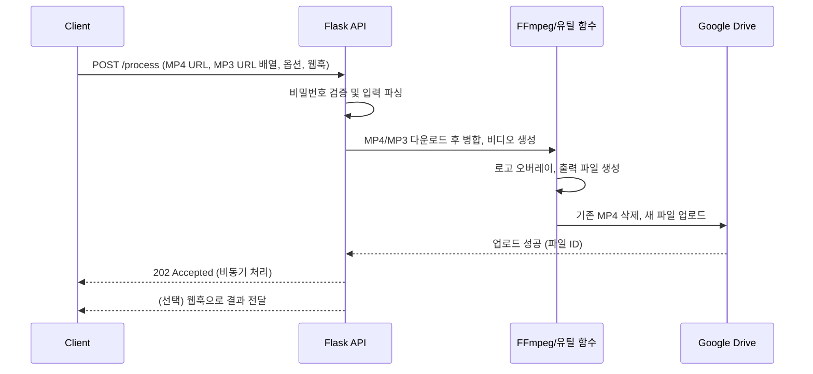

# Make-Video API 서비스

> 📌 **분류**: 비디오 처리 파이프라인 / Flask 기반 백엔드
> - **URL** : "https://www.youtube.com/@TikkadakMusic"
## 프로젝트 개요
Make-Video는 단일 배경 영상(MP4)과 복수의 오디오 트랙(MP3)을 결합하여 완성된 브랜디드 영상을 생성하고, Google Drive에 업로드까지 자동화하는 Flask REST API입니다. 비동기 처리와 웹훅 통합을 염두에 둔 구조로 설계되어 있어, 외부 워크플로우에서 파일 생성 상태를 수신하거나 후속 처리를 이어갈 수 있습니다.

## 주요 기능
- **URL 기반 입력 수집**: 클라이언트가 전달한 MP4 · MP3 다운로드 URL을 안전한 파일명으로 로컬 디렉토리에 저장합니다.
- **오디오 트랙 병합**: 여러 MP3를 순차적으로 연결해 하나의 오디오 트랙으로 만든 뒤, 길이에 맞춰 최종 영상을 생성합니다.
- **비디오 합성 및 인코딩**: FFmpeg을 활용해 지정한 해상도와 FPS로 영상을 재인코딩하고, 최종 영상 길이를 오디오 길이에 맞춥니다.
- **로고 오버레이**: 사전에 준비된 해상도별 로고(`resources/logo_*.png`)를 영상 좌측 상단에 합성합니다.
- **Google Drive 업로드**: 서비스 계정 자격 증명으로 대상 폴더의 기존 MP4를 삭제하고, 새로 생성된 영상을 업로드합니다.
- **비동기 처리/웹훅 대응**: 요청 본문에 웹훅 URL이 포함된 경우, 처리 결과를 비동기로 전달할 수 있도록 설계되어 있습니다.
- **임시 파일 정리**: 처리 종료 후 업로드/출력 디렉토리를 비웁니다.

## 시스템 구성 요소
- `app.py`: Flask 애플리케이션 진입점. `/process` 엔드포인트에서 요청 검증, 파일 다운로드, 비동기 작업 스케줄링을 담당합니다.
- `function.py`: FFmpeg 래퍼 및 Google Drive 업로드 유틸리티, 비밀번호 검증, 디렉토리 정리 로직을 포함한 핵심 비즈니스 모듈입니다.
- `resources/`: 서비스 계정 키, Google Drive 폴더 ID, 접근 비밀번호, 로고 이미지를 보관하는 보안/에셋 디렉토리입니다.
- `usage.py`: 서비스 계정 드라이브 저장소 점검과 파일 삭제를 위한 보조 스크립트입니다.
- `Dockerfile`: API 서버를 컨테이너 환경에서 실행할 수 있도록 구성한 설정입니다.

## 동작 시나리오


## API 요청 형식
`POST /process`
```json
{
  "password": "<resources/password.txt에 저장된 값>",
  "mp4_urls": ["https://example.com/background.mp4"],
  "mp3_urls": ["playlist+https://example.com/intro.mp3,https://example.com/loop.mp3"],
  "genre": ["lofi+beat"],
  "Name": "final_video",
  "logoSize": "720",
  "Pixel": "FHD",   // FHD 선택 시 1920x1080, 그 외에는 1280x720
  "webhook_url": "https://example.com/webhook"
}
```
> MP3 URL 리스트는 `+`와 `,`로 구분되는 특수 포맷을 사용하므로, 클라이언트에서 동일한 규칙으로 전달해야 합니다.

### 응답
- **202 Accepted**: 비동기 처리 시작. 실제 파일 URL/ID는 웹훅으로 통지하도록 확장 가능합니다.
- **4xx**: 인증 실패, 입력 누락 등의 오류 메시지를 JSON으로 반환합니다.

## 설치 및 실행
1. 저장소를 클론하고 프로젝트 루트로 이동합니다.
   ```bash
   git clone <repo-url>
   cd make-video
   ```
2. 필요 패키지를 설치합니다.
   ```bash
   pip install -r requirements.txt
   ```
3. `resources/` 디렉토리에 다음 파일이 준비되어 있어야 합니다.
   - `service_credential.json`: Google Cloud에서 발급받은 서비스 계정 키
   - `drive_folder_id.txt`: 업로드 대상 Google Drive 폴더 ID
   - `password.txt`: API 요청 검증용 비밀번호
   - `logo_720.png`, `logo_1080.png` 등 원하는 해상도별 로고 이미지
4. Flask 개발 서버를 실행합니다.
   ```bash
   python app.py
   ```
   또는 Docker를 활용하여 배포합니다.
   ```bash
   docker build -t make-video-api .
   docker run --rm -p 5000:5000 \
     -v $(pwd)/resources:/app/resources \
     -v $(pwd)/uploads:/app/uploads \
     -v $(pwd)/outputs:/app/outputs \
     make-video-api
   ```

## FFmpeg 의존성
오디오/비디오 병합은 시스템 FFmpeg 바이너리에 의존합니다. 컨테이너 이미지는 FFmpeg 설치를 포함하며, 로컬 환경에서 실행할 경우 `ffmpeg`, `ffprobe` 명령이 사용 가능해야 합니다.

## 보안 및 운영 고려사항
- **비밀번호 관리**: `resources/password.txt`는 민감 정보이므로 버전 관리에서 제외하고 안전하게 배포해야 합니다.
- **서비스 계정 권한**: `drive_folder_id.txt`에 지정된 폴더에 서비스 계정이 쓰기 권한을 가져야 하며, 기존 파일 삭제 로직이 포함되어 있으므로 운영 환경에서 주의하십시오.
- **임시 파일 정리**: 처리 완료 후 `uploads/`, `outputs/` 디렉토리를 비우므로, 다른 프로세스와 공유하지 않는 전용 디렉토리 사용을 권장합니다.
- **웹훅 사용**: 현재 웹훅 호출은 주석 처리되어 있습니다. 필요 시 `send_webhook_response` 호출부의 주석을 해제하여 연동할 수 있습니다.

## 추가 도구
`usage.py` 스크립트를 실행하면 서비스 계정으로 Google Drive 저장소 용량을 조회하고, 필요 시 파일 삭제 루틴을 커스터마이징할 수 있습니다. 운영 배치 작업이나 청소 스크립트로 활용할 수 있습니다.  

  


